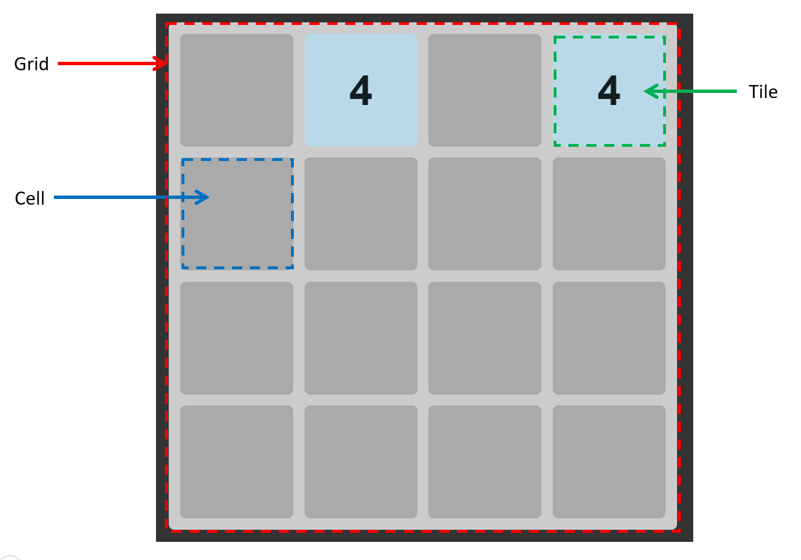

# 2048 Clone

## Introduction
This is a clone of the popular 2048 puzzle game. I followed a [tutorial](https://www.youtube.com/watch?v=wOVEe9eawXc) to learn how an experienced developer would approach this development using pure JavaScript, strengthening my knowledge of JavaScript classes, private methods, promises and CSS transitions.

Other than what was taught in the tutorial, I added touchscreen capability so that I could play this game on a mobile device.

App demo: https://joyfulcumulus.github.io/2048-clone/

## Technologies Used
This project was built with
* HTML
* CSS
* JavaScript

Hosting: Github Pages

## Game Layout Design
### Gameboard – consists of Grid and Cell classes
* `Grid`: a 2-dimension Cartesian plane
* `Cell`: a specific (x,y) position on the grid. Stores information about what `Tile` is on the `Cell`, and whether there is another `Tile` to merge (i.e. `mergeTile`)

### Player Resources – Tile class
* Contains a value (a number that represents its magnitude)
* Contains info about its position (x,y) on the gameboard



## Game Mechanics
* Objective: Get tiles with the highest value possible until the entire grid is full
* Actions: Player can slide the tiles up, down, left, right
* Rules: When sliding tiles, tiles with the same value will merge to a higher value
* State: Player’s score is the current highest value in the grid
* Randomness:
  * At game start, 2 tiles randomly added to the grid
  * After each valid action, a tile will be randomly added to the grid

The game mechanics are made possible by calling on multiple Javascript functions when a player action is detected
* Check if Tile(s) can move (refer to `canMove(cells)`)
* Move Tiles(s) (refer to `slideTiles(cells)`)
* Merge Tile(s) (if any) (refer to `mergeTiles()`)
* Check winning state - if player has lost (see below)

```javascript
if (!canMoveUp() && !canMoveDown() && !canMoveLeft() && !canMoveRight()) {
  newTile.waitForTransition(true).then(() => {
    alert("You lose")
  })
  return
}
```

## Game Controls
### Keyboard Control
* Keyboard control via adding `keydown` event listener, which is invoked only once per turn
* As there are 4 possible values for e.key (`ArrowUp`, `ArrowDown`, `ArrowLeft`, `ArrowRight`), it is clear which direction the players is moving the tiles

### Touchscreen Control
* Touchscreen control via adding `touchstart` and `touchend` event listeners, which are only invoked once per turn
* Additional logic required to calculate swipe distance along X and Y axes, which are compared to assess the direction that the player is moving (left / right / up / down)
* To avoid moving tiles due to accidental touches, a `swipeThreshold` was introduced

## Areas of Improvement
* Make the code less repetitive. There are multiple methods that have similar logic, just that the logic differs based on the movement along X or Y axis

## Further Development
* Add a High Score tracker
* Add a "Restart" game button

## Acknowledgements
Youtube tutorial that I followed: https://www.youtube.com/watch?v=wOVEe9eawXc
